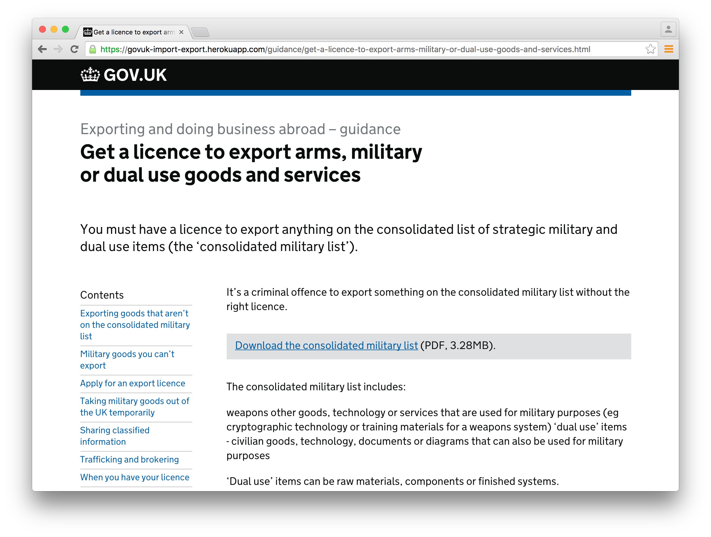

# Import export prototype

This application is a tool for GOV.UK content designers to prototype import and export information in GOV.UK formats and to engage stakeholders by sharing work in a running preview environment.

## Screenshots

## Live examples

* [Declare goods you have moved in or out of the UK](https://govuk-import-export.herokuapp.com/declare-goods-you-ve-moved-in-or-out-of-the-uk-using-intrastat/make-an-intrastat-declaration.html)
* [Get a licence to export arms, military or dual use goods and services](https://govuk-import-export.herokuapp.com/guidance/get-a-licence-to-export-arms-military-or-dual-use-goods-and-services.html)

## Nomenclature

* **Guide**: A mainstream guide, eg: https://www.gov.uk/starting-to-export (publisher app)

* **Guidance**: A detailed guide, eg: https://www.gov.uk/guidance/chief-trader-import-and-export-processing-system (whitehall app)

* **Start**: A mainstream start page, eg: https://www.gov.uk/trade-tariff (publisher app)

* **Topic**: A topic page, eg: https://www.gov.uk/topic/business-tax/import-export (collections publisher app)

* **Answer**: A mainstream answer page, eg: https://www.gov.uk/duty-relief-for-imports-and-exports (publisher app)

## Technical documentation

This is a Jekyll application that contains:

* Jekyll itself, for generating content in GOV.UK formats
* A set of Jeklyll plugins for generating table of contents, navigation and pagination page elements

**NOTE.** As this Jekyll application uses plugins to generate elements of the page content, [it cannot be hosted on GitHub pages] (https://github.com/alphagov/govuk-import-export-prototype/pull/12).

### Dependencies

* [alphagov/govspeak](https://github.com/alphagov/govspeak): provides rendering of GOV.UK's flavour of markdown as used by various publishing systems.

### Building the content

To have Jekyll generate content:

    $ bundle exec jekyll build

### Running the application

To have Jekyll serve the generated content:

    $ bundle exec jekyll serve
